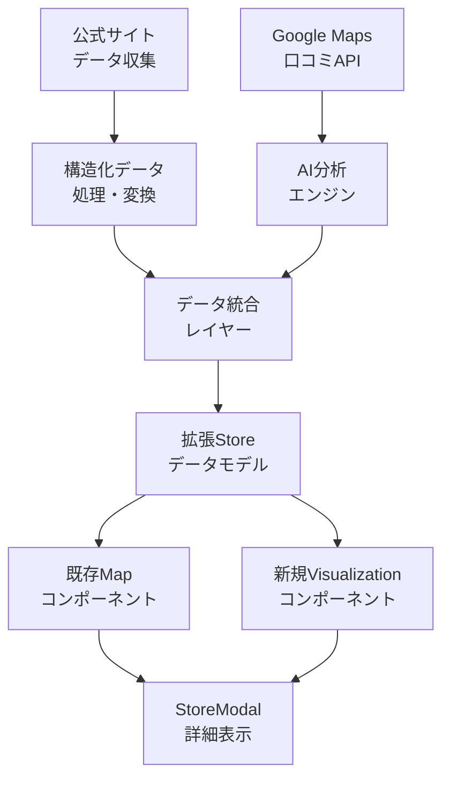
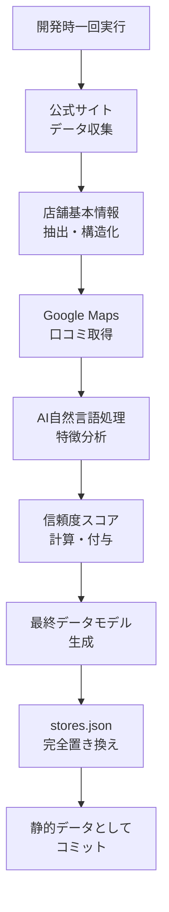
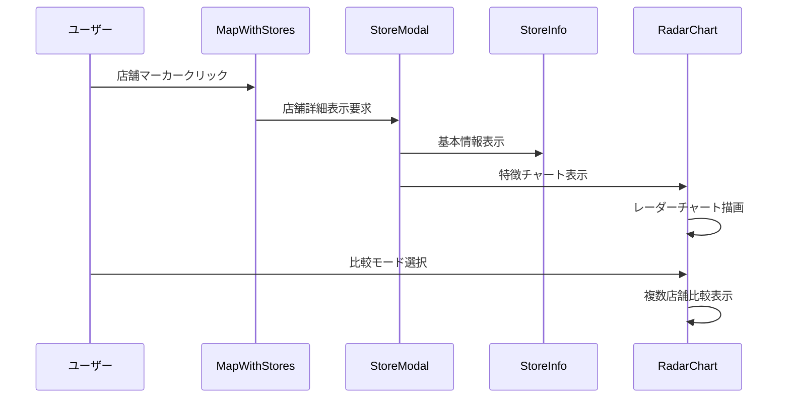

# 技術設計書

## 概要

神戸豚饅マップアプリケーションへの店舗情報収集・AI分析・可視化機能の追加。神戸豚饅サミット公式サイトから神戸市中央区の10店舗の詳細情報を収集し、Google Maps口コミデータのAI分析による特徴抽出、レーダーチャートによる視覚化機能を実装する。既存のNext.js + TypeScript + 静的サイト生成アーキテクチャとの互換性を維持しながら、新たなデータ処理・分析・可視化レイヤーを追加する。

**目的**: 利用者により豊富で客観的な店舗情報を提供し、データ駆動による店舗選択支援を実現する。
**ユーザー**: 豚饅愛好者、観光客、地域住民が店舗比較・選択のためのデータ分析ツールとして活用する。
**影響**: 現在の静的データベース（6店舗）を新規10店舗で置き換え、AI分析による静的特徴データと視覚化機能を追加する。

### Goals
- 神戸豚饅サミット公式サイトから10店舗の構造化データ収集
- AI駆動による豚饅特徴の自動分析・分類システム
- レーダーチャートによる特徴可視化と店舗比較機能
- 既存アプリケーション構造との完全な互換性維持

### Non-Goals
- リアルタイム口コミ分析（バッチ処理での定期更新）
- 推薦システムの完全実装（基盤機能のみ）
- 既存6店舗データの修正・変更

## Architecture

### 既存アーキテクチャ分析

**現在のアーキテクチャパターンと制約**:
- **Static Site Generation**: Next.js 15.5.5 + React 19.1.0による静的サイト生成
- **コンポーネント設計**: Container/Presentation分離パターン
- **データフロー**: `public/data/stores.json` → `src/lib/store-data.ts` → Reactコンポーネント
- **型安全性**: 厳密なTypeScript型定義による静的型チェック

**尊重すべき既存ドメイン境界**:
- **Store Domain**: `src/types/store.ts`, `src/lib/store-data.ts`, `src/components/Store*`
- **Map Domain**: `src/types/map.ts`, `src/lib/google-maps.ts`, `src/components/Map*`
- **UI Domain**: Tailwind CSS + レスポンシブデザインパターン

**維持すべき統合ポイント**:
- 既存の`Store`インターフェース互換性
- `MapWithStores`コンポーネントとの統合
- `StoreModal`での詳細表示拡張

### 高レベルアーキテクチャ



**アーキテクチャ統合**:
- **既存パターン保持**: Container/Presentation分離、静的データローディング、型駆動開発
- **新コンポーネント根拠**: データ収集（WebScraper）、AI分析（ReviewAnalyzer）、可視化（RadarChart）
- **技術整合性**: 既存のNext.js + TypeScript + Tailwindスタックとの完全整合
- **ステアリング準拠**: 静的ファーストアーキテクチャ、コンポーネント合成、型安全性原則の維持

### 技術整合性

既存の技術スタックとの整合性を保ちながら、以下の新規依存関係を追加:

**新規追加依存関係**:
- **Recharts**: レーダーチャート可視化（React + Next.js + TypeScript完全対応）
- **Cheerio**: サーバーサイドHTML解析（店舗情報スクレイピング用）
- **OpenAI API**: 自然言語処理による口コミ分析

**既存パターンからの非逸脱**:
- 静的サイト生成アーキテクチャの維持
- コンポーネント命名規則（PascalCase）とディレクトリ構造の遵守
- `@/`パスマッピングによるクリーンインポート継続

### 主要設計決定

**決定1: 静的データによる分析結果管理**
- **コンテキスト**: AI分析結果の管理とデプロイ効率のバランス
- **代替案**: リアルタイム分析、定期バッチ更新、完全静的データ
- **選択アプローチ**: 一度のAI分析 + 結果の静的JSON統合
- **根拠**: 静的サイト生成との整合性、シンプルな運用、一貫したパフォーマンス
- **トレードオフ**: 動的更新を犠牲にして運用コストとシンプル性を獲得

**決定2: Rechartsライブラリ採用**
- **コンテキスト**: レーダーチャート可視化における技術選択
- **代替案**: Chart.js + react-chartjs-2、D3.js直接利用、Visx
- **選択アプローチ**: Recharts + カスタムレーダーチャートコンポーネント
- **根拠**: Next.js + TypeScript完全対応、コミュニティサポート、学習コスト
- **トレードオフ**: 高度なカスタマイゼーション性を犠牲に開発効率を重視

## System Flows

### データ収集・分析フロー



### ユーザーインタラクションフロー



## Components and Interfaces

### データ収集・処理レイヤー

#### StoreDataCollector

**責任・境界**
- **主要責任**: 神戸豚饅サミット公式サイトからの店舗情報収集・構造化
- **ドメイン境界**: データ収集・ETLドメイン
- **データ所有権**: 生の店舗データと構造化済みデータの管理
- **トランザクション境界**: 単一店舗データ収集の原子性保証

**依存関係**
- **内向き**: ビルドプロセス、手動実行スクリプト
- **外向き**: https://www.kobebutaman-summit.com/shop/ API、ファイルシステム
- **外部**: Cheerio（HTML解析）、Node.js fs（ファイルI/O）

**サービスインターフェース**
```typescript
interface StoreDataCollectorService {
  collectStoreData(storeIds: string[]): Promise<Result<StoreDataCollection, CollectionError>>;
  validateStoreData(data: RawStoreData): Result<ValidatedStoreData, ValidationError>;
  transformToStoreFormat(data: ValidatedStoreData): Result<ExtendedStore, TransformError>;
}
```

- **前提条件**: 対象サイトのアクセス可能性、有効なネットワーク接続
- **後続条件**: 構造化された店舗データの生成、エラーログの記録
- **不変条件**: データ収集中のスキーマ一貫性維持

#### ReviewAnalyzer

**責任・境界**
- **主要責任**: Google Maps口コミデータのAI分析による特徴抽出
- **ドメイン境界**: AI分析・自然言語処理ドメイン
- **データ所有権**: 分析結果データと信頼度スコアの管理
- **トランザクション境界**: 店舗単位の分析処理の原子性

**依存関係**
- **内向き**: StoreDataCollector、開発時実行スクリプト
- **外向き**: OpenAI API、Google Maps API
- **外部**: OpenAI SDK、Google Maps API Client

**サービスインターフェース**
```typescript
interface ReviewAnalyzerService {
  analyzeReviews(storeId: string, reviews: Review[]): Promise<Result<FeatureAnalysis, AnalysisError>>;
  calculateConfidenceScore(analysis: FeatureAnalysis): ConfidenceScore;
  categorizeFeatures(analysis: FeatureAnalysis): CategorizedFeatures;
}

interface FeatureAnalysis {
  taste: number; // 0-10
  texture: number; // 0-10  
  size: number; // 0-10
  priceValue: number; // 0-10
  atmosphere: number; // 0-10
  confidenceScore: number; // 0-100%
  reviewCount: number;
  analysisDate: string;
}
```

- **前提条件**: 有効なAPIキー、分析対象口コミの存在
- **後続条件**: 5軸特徴スコアと信頼度の生成
- **不変条件**: スコア範囲（0-10）と信頼度範囲（0-100%）の維持

### 可視化コンポーネントレイヤー

#### RadarChart

**責任・境界**
- **主要責任**: 豚饅特徴のレーダーチャート可視化と店舗比較
- **ドメイン境界**: UI可視化ドメイン
- **データ所有権**: チャート表示状態とユーザーインタラクション状態
- **状態管理**: 表示モード（単一/比較）、選択店舗、チャート設定

**依存関係**
- **内向き**: StoreModal、StoreInfo
- **外向き**: Recharts、拡張Store型定義
- **外部**: Recharts（RadarChart、PolarGrid、PolarAngleAxis）

**コンポーネントインターフェース**
```typescript
interface RadarChartProps {
  stores: ExtendedStore[];
  mode: 'single' | 'comparison';
  selectedStoreIds: string[];
  onModeChange: (mode: 'single' | 'comparison') => void;
  onStoreSelect: (storeId: string) => void;
}

interface RadarChartState {
  displayMode: 'single' | 'comparison';
  comparisonStores: ExtendedStore[];
  chartDimensions: { width: number; height: number };
  isLoading: boolean;
}
```

**統合戦略**
- **修正アプローチ**: StoreModalコンポーネントの拡張（新タブ追加）
- **後方互換性**: 既存の店舗詳細表示機能の保持
- **マイグレーション**: 段階的な機能追加、既存UIの非破壊的拡張

## Data Models

### 物理データモデル

**拡張Store型定義**
```typescript
interface ExtendedStore extends Store {
  // 既存フィールドは全て保持
  
  // AI分析結果フィールド（オプション）
  aiAnalysis?: {
    features: {
      taste: number;        // 味の濃さ (0-10)
      texture: number;      // 食感 (0-10)
      size: number;         // ボリューム (0-10)
      priceValue: number;   // 価格満足度 (0-10)
      atmosphere: number;   // 総合評価 (0-10)
    };
    confidence: number;     // 信頼度スコア (0-100%)
    reviewCount: number;    // 分析対象口コミ数
    analysisDate: string;   // 分析実行日時
  };
  
  // データ収集メタデータ
  dataSource: {
    collectionDate: string;  // データ収集日時
    sourceUrl: string;       // 収集元URL
    isEnhanced: boolean;     // AI分析実施フラグ
  };
}
```

**データ置き換え戦略**
```typescript
interface StoreDataReplacement {
  // 既存データ（置き換え前）
  legacyStores: Store[];
  
  // 新規10店舗データ（AI分析付き）
  enhancedStores: ExtendedStore[];
  
  // 最終データ（完全置き換え）
  finalStores: ExtendedStore[];
}
```

### データ契約・統合

**API データ転送**
```typescript
interface StoreCollectionRequest {
  storeIds: string[];
  includeReviews: boolean;
  analysisDepth: 'basic' | 'detailed';
}

interface StoreCollectionResponse {
  stores: ExtendedStore[];
  collectionMetadata: {
    timestamp: string;
    successCount: number;
    errorCount: number;
    errors: CollectionError[];
  };
}
```

**スキーマバージョニング戦略**
- **後方互換性**: 既存Storeインターフェースの完全保持
- **前方互換性**: オプショナルフィールドによる段階的機能拡張
- **マイグレーション**: 既存データの非破壊的拡張

## Error Handling

### エラー戦略

AI分析とデータ収集における堅牢なエラーハンドリングパターンと復旧メカニズム。

### エラーカテゴリと対応

**データ収集エラー (4xx)**: サイト構造変更 → フォールバック取得; レート制限 → 指数バックオフ; 認証失敗 → 手動収集モード
**AI分析エラー (5xx)**: API制限 → デフォルト特徴値; モデル障害 → 基本分析モード; ネットワーク障害 → リトライ機構
**統合エラー (422)**: スキーマ不整合 → 検証・修復; データ欠損 → 補完処理; 型変換失敗 → セーフ変換

### 監視

エラー追跡、ログ記録、ヘルスモニタリングをビルドプロセスに統合。

## Testing Strategy

### 単体テスト
- StoreDataCollectorService: 店舗データ収集・変換・検証メソッド
- ReviewAnalyzerService: AI分析結果処理・信頼度計算・特徴分類
- RadarChartComponent: チャート描画・インタラクション・状態管理
- ExtendedStore型定義: データ整合性・変換・検証
- エラーハンドリング: 各種障害シナリオでの復旧動作

### 統合テスト  
- データ収集→分析→可視化のエンドツーエンドフロー
- 既存StoreModalとRadarChart統合動作
- AI分析結果とUI表示の整合性検証
- バッチ処理とビルドプロセスの統合
- 拡張データモデルと既存コンポーネント互換性

### E2E/UIテスト
- 店舗詳細モーダルでのレーダーチャート表示
- 複数店舗比較モードの操作フロー
- モバイル端末でのレスポンシブチャート表示
- データ読み込み中のローディング状態管理
- エラー状態でのユーザーフィードバック表示

### パフォーマンステスト
- 10店舗データ読み込み時の初期表示速度（目標: 3秒以内）
- レーダーチャート描画応答性（目標: 1秒以内）
- 複数店舗比較時のメモリ使用量監視
- 静的データファイルサイズの最適化確認