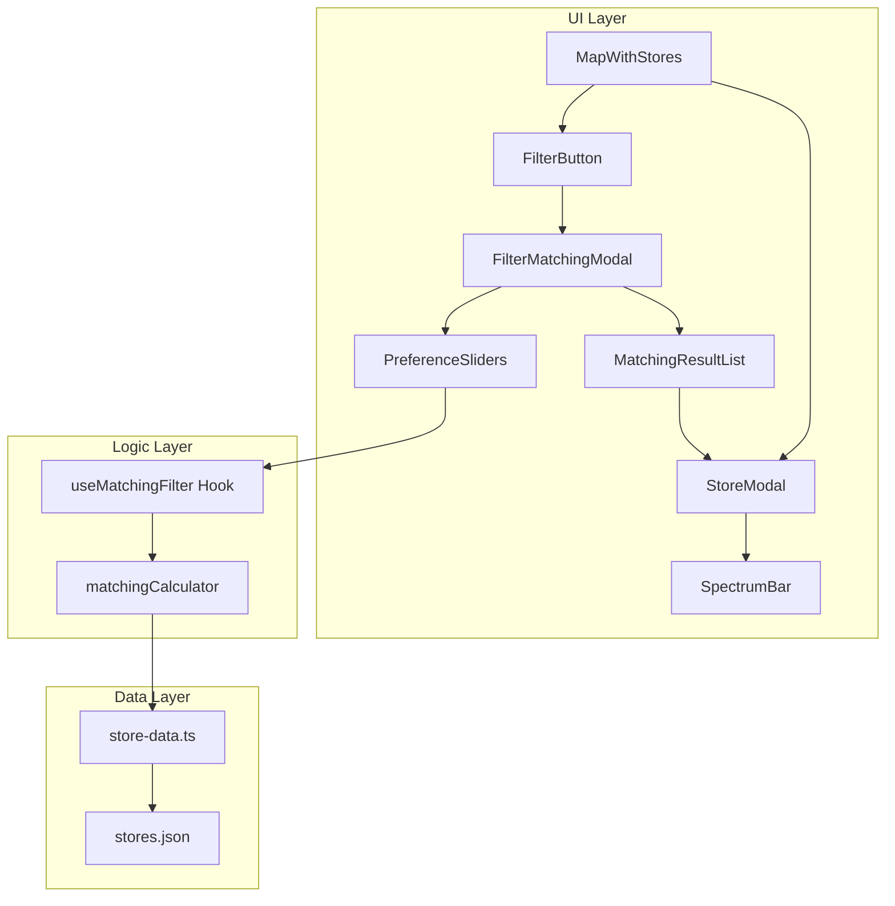
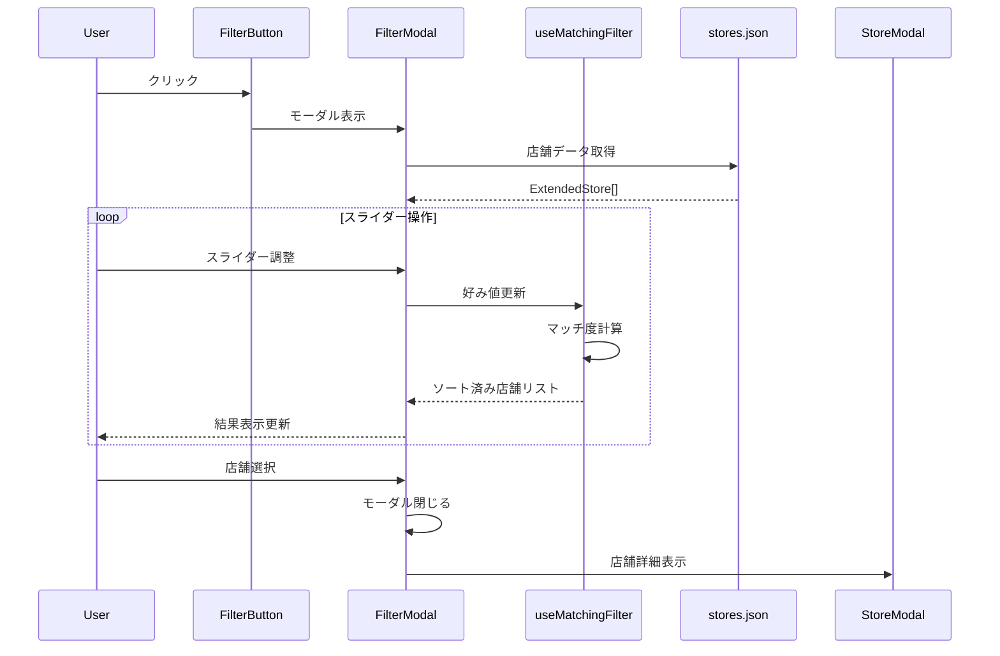
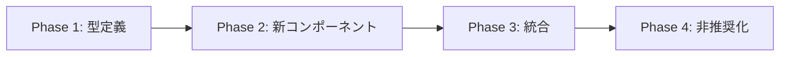

# Technical Design Document

## Overview

**Purpose**: 本機能は、神戸豚饅マップにおいて店舗の特徴を対比スタイル（スペクトラム）で視覚化し、ユーザーの好みに基づいたフィルター式マッチング機能を提供する。

**Users**: 豚饅店を探しているユーザーが、自分の好みに合った店舗を効率的に発見できるようになる。

**Impact**: 既存のレーダーチャート（5軸: taste, texture, size, priceValue, atmosphere）を新しい対比スタイル評価軸（4軸: skinStyle, fillingStyle, overallTaste, size）に置き換え、フィルター式マッチング機能を追加する。

### Goals
- 店舗詳細モーダルにスペクトラムバー表示を実装
- フィルター式マッチング機能でユーザーの好みに合う店舗を提案
- 既存のコンポーネント構造を活用した効率的な実装
- リアルタイム更新による快適なUX

### Non-Goals
- 既存のレーダーチャートコンポーネント（RadarChart, SingleStoreRadarChart等）の削除
- stores.json以外のデータソース対応
- サーバーサイドでのマッチング計算

---

## Architecture

### Existing Architecture Analysis

現在のコードベースは以下の構造を持つ:
- **StoreModal.tsx**: 店舗詳細モーダル（SingleStoreRadarChartを使用）
- **AIAnalysisModal.tsx**: 複数店舗比較モーダル
- **FeatureAnalysis型**: 旧5軸評価（taste, texture, size, priceValue, atmosphere）

**課題**: 現在の型定義（FeatureAnalysis）とstores.jsonの実際のデータ（skinStyle, fillingStyle, overallTaste, size）に不整合がある。この設計では新しい4軸評価に統一する。

### High-Level Architecture



### Technology Alignment

- **既存パターン維持**: Reactコンポーネント、カスタムフック、Tailwind CSS
- **新規依存ライブラリ**: なし（純粋なReact/TypeScript実装）
- **Rechartsからの移行**: スペクトラムバーは純粋なCSS/Tailwindで実装

### Key Design Decisions

#### Decision 1: 型定義の統一
- **Decision**: FeatureAnalysis型を新しい4軸評価に更新
- **Context**: stores.jsonのデータ構造と型定義の不整合
- **Alternatives**:
  1. 両方の型を保持してアダプター層を追加
  2. stores.jsonを旧形式に戻す
- **Selected Approach**: 型定義を新形式に統一し、旧レーダーチャートコンポーネントは非推奨とする
- **Rationale**: データの一貫性を保ち、将来のメンテナンスを容易にする
- **Trade-offs**: 旧レーダーチャートコンポーネントが動作しなくなるが、新UIに完全移行する

#### Decision 2: スペクトラムバーの実装方式
- **Decision**: 純粋なCSS/Tailwindでスペクトラムバーを実装
- **Context**: 視覚的にシンプルなバー表示が必要
- **Alternatives**:
  1. Rechartsのカスタムチャート
  2. D3.jsベースの実装
- **Selected Approach**: Tailwind CSSのユーティリティクラスで実装
- **Rationale**: 軽量で高速、既存の技術スタックに適合
- **Trade-offs**: アニメーションの柔軟性は低下するが、パフォーマンスが向上

#### Decision 3: マッチング計算のクライアントサイド実装
- **Decision**: マッチング計算をクライアントサイドで実行
- **Context**: 店舗数が限定的（〜20店舗）
- **Alternatives**:
  1. サーバーサイドAPI
  2. Web Worker使用
- **Selected Approach**: React状態管理内で同期計算
- **Rationale**: 店舗数が少なくリアルタイム更新が可能、追加インフラ不要
- **Trade-offs**: 店舗数が大幅に増加した場合は再検討が必要

---

## System Flows

### フィルターマッチングフロー



---

## Requirements Traceability

| Requirement | Summary | Components | Interfaces |
|-------------|---------|------------|------------|
| 1.1-1.4 | スペクトラムバー表示 | SpectrumBar, StoreModal | SpectrumBarProps |
| 2.1-2.5 | フィルター式マッチング | FilterMatchingModal, PreferenceSlider | useMatchingFilter |
| 3.1-3.3 | マッチ度計算 | matchingCalculator | calculateMatchScore |
| 4.1-4.5 | フィルターUI/UX | FilterButton, FilterMatchingModal | FilterModalProps |
| 5.1-5.3 | レスポンシブ | 全UIコンポーネント | Tailwind responsive |
| 6.1-6.3 | パフォーマンス | useMatchingFilter | useMemo, useCallback |

---

## Components and Interfaces

### 型定義（Types）

#### SpectrumFeatureAnalysis（新規）

**Responsibility & Boundaries**
- **Primary Responsibility**: 対比スタイル4軸評価のデータ構造を定義
- **Domain Boundary**: 店舗データドメイン
- **Data Ownership**: stores.jsonのaiAnalysis.features

**Contract Definition**

```typescript
interface SpectrumFeatureAnalysis {
  /** 皮のスタイル: 薄皮ふわふわ(1-3) ↔ 厚皮もちもち(7-10) */
  skinStyle: number
  /** 餡のスタイル: あっさり野菜多め(1-3) ↔ こってり肉感強め(7-10) */
  fillingStyle: number
  /** 全体の味わい: 優しい味上品(1-3) ↔ パンチのある味濃いめ(7-10) */
  overallTaste: number
  /** サイズ: 小ぶり食べ歩き向き(1-3) ↔ 大ぶり満足感(7-10) */
  size: number
}

interface SpectrumAxisConfig {
  key: keyof SpectrumFeatureAnalysis
  leftLabel: string
  rightLabel: string
}

const SPECTRUM_AXES: SpectrumAxisConfig[] = [
  { key: 'skinStyle', leftLabel: '薄皮ふわふわ', rightLabel: '厚皮もちもち' },
  { key: 'fillingStyle', leftLabel: 'あっさり', rightLabel: 'こってり' },
  { key: 'overallTaste', leftLabel: '優しい味', rightLabel: 'パンチ' },
  { key: 'size', leftLabel: '小ぶり', rightLabel: '大ぶり' }
]
```

#### UserPreferences（新規）

```typescript
interface UserPreferences {
  skinStyle: number
  fillingStyle: number
  overallTaste: number
  size: number
}

interface StoreMatchResult {
  store: ExtendedStore
  matchScore: number // 0-100
}
```

---

### UIコンポーネント

#### SpectrumBar

**Responsibility & Boundaries**
- **Primary Responsibility**: 単一評価軸のスペクトラムバー表示
- **Domain Boundary**: プレゼンテーション層

**Dependencies**
- **Inbound**: StoreModal, FilterMatchingModal
- **Outbound**: なし
- **External**: Tailwind CSS

**Contract Definition**

```typescript
interface SpectrumBarProps {
  /** 評価軸の設定 */
  axis: SpectrumAxisConfig
  /** 現在の値 (1-10) */
  value: number
  /** 値変更コールバック（スライダーモードのみ） */
  onChange?: (value: number) => void
  /** 読み取り専用モード（店舗詳細用） */
  readonly?: boolean
}

interface SpectrumBarComponent {
  (props: SpectrumBarProps): JSX.Element
}
```

**State Management**
- **State Model**: 外部制御（Controlled Component）
- **Persistence**: なし

---

#### FilterMatchingModal

**Responsibility & Boundaries**
- **Primary Responsibility**: フィルター設定とマッチング結果の表示
- **Domain Boundary**: 店舗検索機能

**Dependencies**
- **Inbound**: page.tsx（メインページ）
- **Outbound**: useMatchingFilter, SpectrumBar, StoreModal
- **External**: ExtendedStore[]

**Contract Definition**

```typescript
interface FilterMatchingModalProps {
  isOpen: boolean
  onClose: () => void
  stores: ExtendedStore[]
  onStoreSelect: (store: ExtendedStore) => void
}

interface FilterMatchingModalComponent {
  (props: FilterMatchingModalProps): JSX.Element
}
```

**State Management**
- **State Model**:
  - `preferences: UserPreferences` - ユーザーの好み設定
  - `matchResults: StoreMatchResult[]` - 計算済みマッチ結果
- **Persistence**: なし（セッション内のみ）

---

#### FilterButton

**Responsibility & Boundaries**
- **Primary Responsibility**: フィルターモーダルへのアクセスボタン
- **Domain Boundary**: ナビゲーション

**Contract Definition**

```typescript
interface FilterButtonProps {
  onClick: () => void
}

interface FilterButtonComponent {
  (props: FilterButtonProps): JSX.Element
}
```

---

### ロジック層

#### useMatchingFilter Hook

**Responsibility & Boundaries**
- **Primary Responsibility**: マッチング計算とソートのカスタムフック
- **Domain Boundary**: ビジネスロジック

**Dependencies**
- **Inbound**: FilterMatchingModal
- **Outbound**: matchingCalculator
- **External**: ExtendedStore[]

**Contract Definition**

```typescript
interface UseMatchingFilterOptions {
  stores: ExtendedStore[]
  initialPreferences?: UserPreferences
}

interface UseMatchingFilterReturn {
  preferences: UserPreferences
  setPreferences: (prefs: UserPreferences) => void
  updatePreference: (key: keyof UserPreferences, value: number) => void
  matchResults: StoreMatchResult[]
  resetPreferences: () => void
}

function useMatchingFilter(options: UseMatchingFilterOptions): UseMatchingFilterReturn
```

**Preconditions**: storesは有効なExtendedStore配列
**Postconditions**: matchResultsはマッチ度降順でソート済み
**Invariants**: aiAnalysisがない店舗は結果から除外

---

#### matchingCalculator

**Responsibility & Boundaries**
- **Primary Responsibility**: マッチ度スコアの計算
- **Domain Boundary**: 計算ロジック

**Contract Definition**

```typescript
interface MatchingCalculator {
  /**
   * 単一店舗のマッチ度を計算
   * @param store 評価対象店舗
   * @param preferences ユーザーの好み
   * @returns 0-100のマッチ度スコア
   */
  calculateMatchScore(
    store: ExtendedStore,
    preferences: UserPreferences
  ): number

  /**
   * 複数店舗のマッチ度を計算してソート
   * @param stores 店舗リスト
   * @param preferences ユーザーの好み
   * @returns マッチ度降順のStoreMatchResult配列
   */
  calculateAndSortMatches(
    stores: ExtendedStore[],
    preferences: UserPreferences
  ): StoreMatchResult[]
}
```

**計算アルゴリズム**:
1. 各軸の差分を計算: `diff = |userPref - storeValue|`
2. 各軸の類似度を計算: `similarity = 1 - (diff / 9)` (最大差分は9)
3. 4軸の平均を計算: `avgSimilarity = sum(similarities) / 4`
4. パーセンテージに変換: `matchScore = avgSimilarity * 100`

---

## Data Models

### Domain Model

#### FeatureAnalysis型の更新

既存の`FeatureAnalysis`型を`SpectrumFeatureAnalysis`に置き換える:

```typescript
// 旧型（非推奨化）
interface FeatureAnalysis {
  taste: number
  texture: number
  size: number
  priceValue: number
  atmosphere: number
}

// 新型
interface SpectrumFeatureAnalysis {
  skinStyle: number
  fillingStyle: number
  overallTaste: number
  size: number
}
```

### Data Contracts

**stores.json構造（既存・維持）**:
```json
{
  "stores": [
    {
      "id": "string",
      "name": "string",
      "aiAnalysis": {
        "features": {
          "skinStyle": 8,
          "fillingStyle": 5,
          "overallTaste": 6,
          "size": 3
        },
        "analysisDate": "2026-01-13"
      }
    }
  ]
}
```

---

## Error Handling

### Error Categories and Responses

**User Errors**:
- aiAnalysisデータがない店舗 → マッチング結果から除外、スペクトラムバー非表示

**System Errors**:
- stores.json読み込み失敗 → 既存のエラーハンドリングを継続使用
- 計算エラー → コンソールログ、デフォルト値使用

### Monitoring
- 既存のconsole.errorパターンを継続

---

## Testing Strategy

### Unit Tests
- `matchingCalculator.test.ts`: マッチ度計算ロジック
- `SpectrumBar.test.tsx`: バー表示とスライダー操作
- `useMatchingFilter.test.ts`: フックの状態管理

### Integration Tests
- `FilterMatchingModal.test.tsx`: モーダル全体のインタラクション
- `StoreModal.test.tsx`: スペクトラムバー表示の統合

### E2E Tests
- フィルター機能の全体フロー
- スライダー操作からマッチング結果表示まで

---

## Migration Strategy

### Phase 1: 型定義の更新
1. `SpectrumFeatureAnalysis`型を追加
2. 旧`FeatureAnalysis`型を`@deprecated`としてマーク
3. `SPECTRUM_AXES`設定を追加

### Phase 2: 新コンポーネント実装
1. `SpectrumBar`コンポーネント作成
2. `FilterMatchingModal`コンポーネント作成
3. `useMatchingFilter`フック作成
4. `matchingCalculator`ユーティリティ作成

### Phase 3: 既存コンポーネント更新
1. `StoreModal`にスペクトラムバーを統合
2. `page.tsx`にフィルターボタンとモーダルを追加

### Phase 4: 旧コンポーネント非推奨化
1. `SingleStoreRadarChart`を非推奨としてマーク
2. 将来のリリースで削除予定


